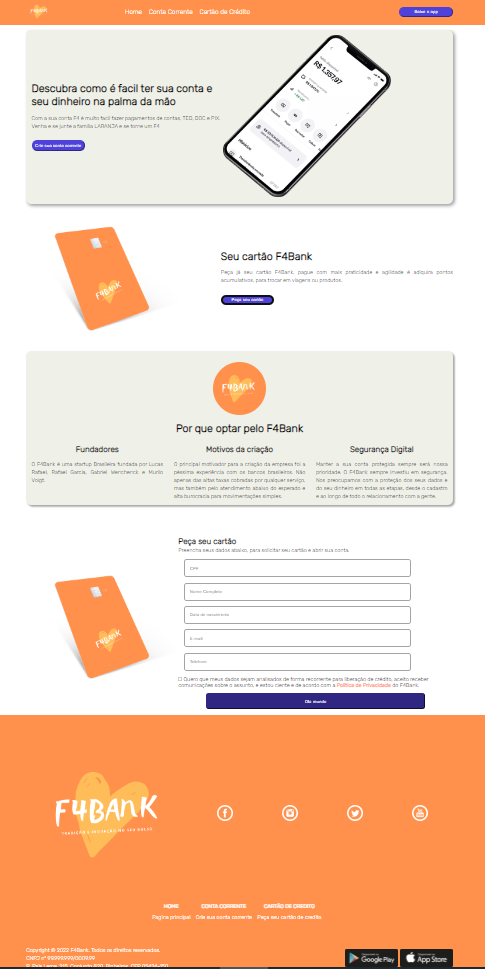

# landing-page-template

## Desenvolvedores

- Gabriel Inácio Wenchenck de Carvalho
- Lucas Rafael Martins de Paula
- Murilo Voigt Schlickmann
- Rafael Garcia Nunes

## Link

https://acrid-hook.surge.sh

## Descrição das funcionalidades do site:

- Site de um banco, que consiste em uma barra inicial com as opções home, conta corrente e cartão de crédito.
- No corpo do nosso site, há dois produtos disponíveis, a criação de uma conta corrente e a oferta de um cartão do banco. Além disso, há uma descrição sobre a empresa, bem como uma área para o cliente inserir os dados e realizar o pedido do cartão.
- O rodapé contém informações como endereço e redes sociais da empresa.
- Por fim, o site foi produzido pensando em acessibilidade, ou seja, utilizando de tags semânticas. Além disso, foi feito um trabalho pensando na responsividade do site em diversos dispositivos móveis.

## Imagens:

